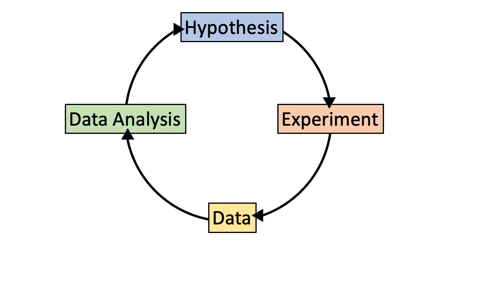
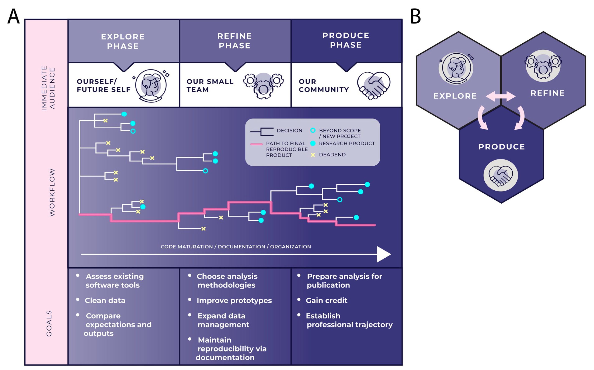
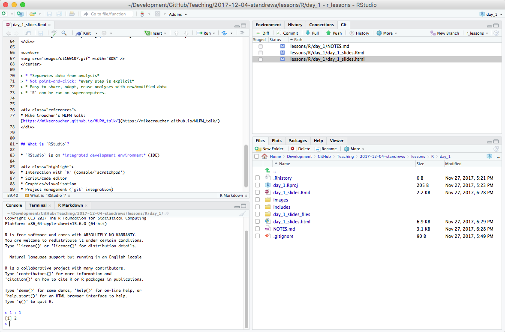

```{r setup, include=FALSE}
knitr::opts_chunk$set(echo = TRUE)
```

# 1. Data Analysis

## Data Analysis in the Scientific Cycle

<center>

</center>

## Data-Intensive Research

- **Science and humanities are increasingly data-driven**
  - Early-career training has not prepared all researchers for this
  
<div class="highlight">
**Research Workflows**
</div>
- Enable systematic, replicable and reproducible work
  - Design principles
    - **Best practices** for data
  - Software development methods
    - **Automation** of repetitive calculations
 
<div class="references">
* Ten great papers for biologists starting out in computational biology <https://widdowquinn.github.io/ten_great_papers/>
</class>
 

## Pipelines and Workflows

<div class="highlight">
**Pipeline**
</div>
- What a computer does
  - A series of instructions
  - Data is *piped* through programs, and a result emerges

<div class="highlight">
**Workflow**
</div>
- What a researcher does
  - Exploring data, developing hypotheses, writing code, interpreting results
- Outputs include:
  - datasets, methods, teaching materials, software, papers, etc.


## Explore, Refine, Produce (ERP)

<center>

</center>

- [Reproduced from Stoudt *et al.* (2021)](https://doi.org/10.1371/journal.pcbi.1008770.g001)


# 2. Welcome to R


## Learning Objectives

- Fundamentals of `R` and `RStudio`
- Fundamentals of programming (in `R`)
- Data management with the `tidyverse`
- Publication-quality data visualisation with `ggplot2`
- Reporting with `RMarkdown`


## What is `R`?

- `R` is:
  - a programming language
  - the software that interprets/runs programs written in the `R` language

<div class="highlight">
**Why use `R`**?
</div>

- free (though commercial support can be bought)
- widely used
  - sciences, humanities, engineering, statistics, etc.
- has many excellent specialised packages for data analysis and visualisation
- international, friendly user community

<div class="references">
- RStudio community support: <https://community.rstudio.com/>
- Stack Overflow: <https://stackoverflow.com/>
</div>


## What is `RStudio`?

<div class="attention">
**Please start `RStudio`**
</div>

- `RStudio` is an *integrated development environment* (IDE)

<center>


</center>

<div class="highlight">
- Script/code editor; Project management
- Interaction with `R` (console/'scratchpad'); Graphics/visualisation/Help
</div>


## "Why not use `Excel`?"

<div class="highlight">
- `Excel` is good for some things
- `R` is excellent for analysis and reproducibility…
</div>

<center>

</center>

- ***Separates data from analysis***
- Not point-and-click: *every step is explicit and transparent*
- Easy to share, adapt, reuse, publish analyses with new/modified data (GitHub)
- `R` can be run on supercomputers, with *extremely* large datasets…

    
<div class="references">
* Mike Croucher's MLPM talk: <https://mikecroucher.github.io/MLPM_talk/>
</div>

## `RStudio` overview - INTERACTIVE DEMO

<center>

</center>


## Variables

<div class="highlight">
**Variables** are like *named boxes*
</div>

* An item (*object*) of data goes in the box (which is called `Name`)
* When we refer to the box (*variable*) by its name, we really mean *what's in the box*

<center>

</center>

## Variables - Interactive Demo

```{r, }
x <- 1 / 40
x
x ^ 2
log(x)
name <- "Samia"
name
```


## Naming Variables

<div class="highlight">
**Variable names are documentation**
</div>

```{r}
current_temperature = 28.6
subjectID = "GCF_00001236452.1"
GPS_Location = "54N, 36E"
```

- descriptive, but not *too* long
- letters, numbers, underscores, and periods (`[a-zA-z0-9_.]`)
- cannot contain whitespace or start with a number (`x2` is allowed, `2x` is not)
- case sensitive (`Weight` is not the same as `weight`)
- **do not reuse names of built-in functions**
- Consistent style:
  - `lower_snake`, `UPPER_SNAKE`, `lowerCamelCase`, `UpperCamelCase`


## Functions

<div class="highlight">
**Functions (`log()`, `sin()` etc.) ≈ "canned script"**
</div>

- automate complicated tasks
- make code more readable and reusable

<div class="attention">
- Functions usually take *arguments* (*input*)
- Functions often *return* values (*output*)
</div>

- Some functions are built-in (in *base* packages, e.g. `sqrt()`, `lm()`, `plot()`)
- Groups of related functions can be *imported* as *libraries*


## Getting Help in `R`

<center>
<div class="attention">
**INTERACTIVE DEMO**
</div>
</center>

```{r, eval=FALSE}
args(fname)            # arguments for fname
?fname                 # help page for fname
help(fname)            # help page for fname
??fname                # any mention of fname
help.search("text")    # any mention of "text"
vignette(fname)        # worked examples for fname
vignette()             # show all available vignettes
```

## Challenge 01 (1min)

<div class="highlight">
What will be the value of each variable after each statement in the following program?
</div>

```{r, echo=TRUE}
mass <- 47.5
age <- 122
mass <- mass * 2.3
age <- age - 20
```

* `mass = 47.5, age = 102`
* `mass = 109.25, age = 102`
* `mass = 47.5, age = 122`
* `mass = 109.25, age = 122`

<center>
<div class="attention">
**USE CHALLENGE LINK ON ETHERPAD**
</div>
</center>


# 3. Project Management in `R`


## Good Practice

<center>
<div class="highlight">
**THERE IS NO ONE TRUE WAY (only principles)**
</div>
</center>

- Use a **single working directory per project/analysis**
  - easier to move, share, and find files
  - use *relative paths* to locate files
- **Treat raw data as read-only**
  - keep in a separate subfolder (`data`?)
- **Clean data ready for work**
  - keep cleaned/modified data in separate folder (`clean_data`?)
- **Consider output generated by analysis to be disposable**
  - can be regenerated by running analysis/code


<div class="references">
* Good Enough Practices in Scientific Computing (2017) Wilson *et al.* <http://journals.plos.org/ploscompbiol/article?id=10.1371/journal.pcbi.1005510>
</class>

