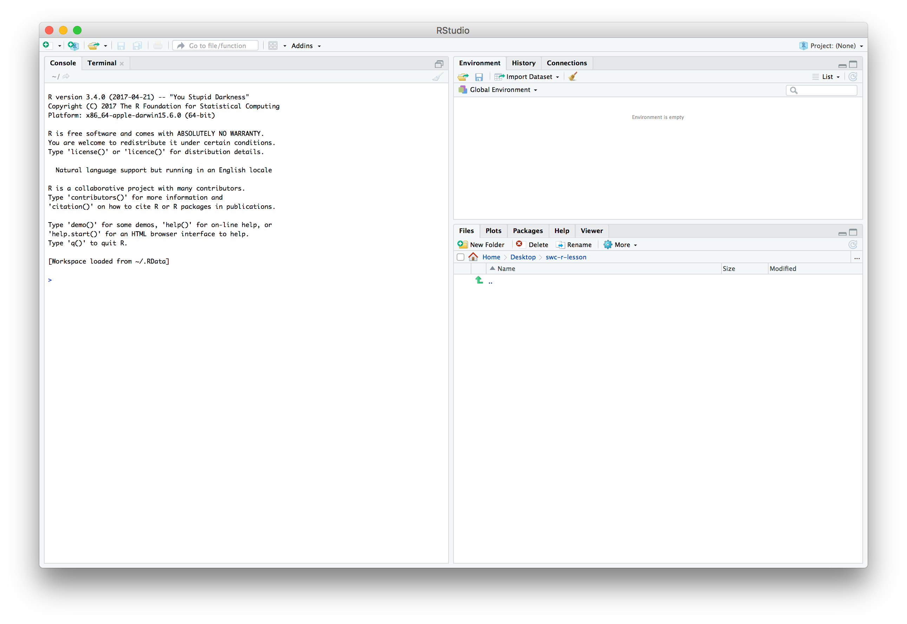
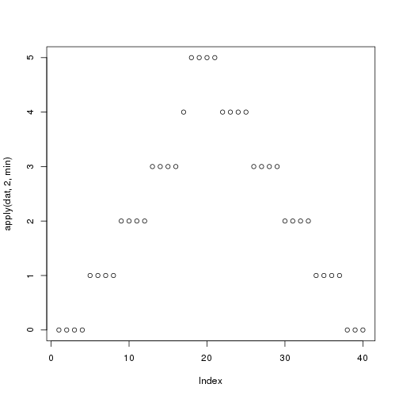

```{r setup, include=FALSE}
knitr::opts_chunk$set(echo = TRUE)
```

# 1. Data Analysis

## Data Analysis in the Scientific Cycle

<center>

</center>

## Data-Intensive Research

- **Science and humanities are increasingly data-driven**
  - Early-career training has not prepared all researchers for this
  
<div class="highlight">
**Research Workflows**
</div>
- Enable systematic, replicable and reproducible work
  - Design principles
    - **Best practices** for data
  - Software development methods
    - **Automation** of repetitive calculations
 
<div class="references">
* Ten great papers for biologists starting out in computational biology <https://widdowquinn.github.io/ten_great_papers/>
</class>
 

## Pipelines and Workflows

<div class="highlight">
**Pipeline**
</div>
- What a computer does
  - A series of instructions
  - Data is *piped* through programs, and a result emerges

<div class="highlight">
**Workflow**
</div>
- What a researcher does
  - Exploring data, developing hypotheses, writing code, interpreting results
- Outputs include:
  - datasets, methods, teaching materials, software, papers, etc.


## Explore, Refine, Produce (ERP)

<center>

</center>

- [Reproduced from Stoudt *et al.* (2021)](https://doi.org/10.1371/journal.pcbi.1008770.g001)


# 2. Welcome to R


## Learning Objectives

- Fundamentals of `R` and `RStudio`
- Fundamentals of programming (in `R`)
- Data management with the `tidyverse`
- Publication-quality data visualisation with `ggplot2`
- Reporting with `RMarkdown`


## What is `R`?

- `R` is:
  - a programming language
  - the software that interprets/runs programs written in the `R` language

<div class="highlight">
**Why use `R`**?
</div>

- free (though commercial support can be bought)
- widely used
  - sciences, humanities, engineering, statistics, etc.
- has many excellent specialised packages for data analysis and visualisation
- international, friendly user community

<div class="references">
- RStudio community support: <https://community.rstudio.com/>
- Stack Overflow: <https://stackoverflow.com/>
</div>


## What is `RStudio`?

<div class="attention">
**Please start `RStudio`**
</div>

- `RStudio` is an *integrated development environment* (IDE)

<center>


</center>

<div class="highlight">
- Script/code editor; Project management
- Interaction with `R` (console/'scratchpad'); Graphics/visualisation/Help
</div>


## "Why not use `Excel`?"

<div class="highlight">
- `Excel` is good for some things
- `R` is excellent for analysis and reproducibility…
</div>

<center>

</center>

- ***Separates data from analysis***
- Not point-and-click: *every step is explicit and transparent*
- Easy to share, adapt, reuse, publish analyses with new/modified data (GitHub)
- `R` can be run on supercomputers, with *extremely* large datasets…

    
<div class="references">
* Mike Croucher's MLPM talk: <https://mikecroucher.github.io/MLPM_talk/>
</div>

## `RStudio` overview - INTERACTIVE DEMO

<center>

</center>


## Variables

<div class="highlight">
**Variables** are like *named boxes*
</div>

* An item (*object*) of data goes in the box (which is called `Name`)
* When we refer to the box (*variable*) by its name, we really mean *what's in the box*

<center>

</center>

## Variables - Interactive Demo

```{r, }
x <- 1 / 40
x
x ^ 2
log(x)
name <- "Samia"
name
```


## Naming Variables

<div class="highlight">
**Variable names are documentation**
</div>

```{r}
current_temperature = 28.6
subjectID = "GCF_00001236452.1"
GPS_Location = "54N, 36E"
```

- descriptive, but not *too* long
- letters, numbers, underscores, and periods (`[a-zA-z0-9_.]`)
- cannot contain whitespace or start with a number (`x2` is allowed, `2x` is not)
- case sensitive (`Weight` is not the same as `weight`)
- **do not reuse names of built-in functions**
- Consistent style:
  - `lower_snake`, `UPPER_SNAKE`, `lowerCamelCase`, `UpperCamelCase`


## Functions

<div class="highlight">
**Functions (`log()`, `sin()` etc.) ≈ "canned script"**
</div>

- automate complicated tasks
- make code more readable and reusable

<div class="attention">
- Functions usually take *arguments* (*input*)
- Functions often *return* values (*output*)
</div>

- Some functions are built-in (in *base* packages, e.g. `sqrt()`, `lm()`, `plot()`)
- Groups of related functions can be *imported* as *libraries*


## Getting Help in `R`

<center>
<div class="attention">
**INTERACTIVE DEMO**
</div>
</center>

```{r, eval=FALSE}
args(fname)            # arguments for fname
?fname                 # help page for fname
help(fname)            # help page for fname
??fname                # any mention of fname
help.search("text")    # any mention of "text"
vignette(fname)        # worked examples for fname
vignette()             # show all available vignettes
```

## Challenge 01 (1min)

<div class="highlight">
What will be the value of each variable after each statement in the following program?
</div>

```{r, echo=TRUE}
mass <- 47.5
age <- 122
mass <- mass * 2.3
age <- age - 20
```

* `mass = 47.5, age = 102`
* `mass = 109.25, age = 102`
* `mass = 47.5, age = 122`
* `mass = 109.25, age = 122`

<center>
<div class="attention">
**USE CHALLENGE LINK ON ETHERPAD**
</div>
</center>


# 3. Project Management in `R`


## How Projects Tend To Grow

<center>

</center>

## Good Practice

<center>
<div class="highlight">
**THERE IS NO ONE TRUE WAY (only principles)**
</div>
</center>

- Use a **single working directory per project/analysis**
  - easier to move, share, and find files
  - use *relative paths* to locate files
- **Treat raw data as read-only**
  - keep in a separate subfolder (`data`?)
- **Clean data ready for work *programmatically* **
  - keep cleaned/modified data in separate folder (`clean_data`?)
- **Consider output generated by analysis to be disposable**
  - can be regenerated by running analysis/code


<div class="references">
* Good Enough Practices in Scientific Computing (2017) Wilson *et al.* <http://journals.plos.org/ploscompbiol/article?id=10.1371/journal.pcbi.1005510>
</class>


## Example Directory Structure

<center>

</center>


## Project Management in `RStudio`

* `RStudio` tries to help you manage your projects
    * `R Project` concept - files and subdirectory structure
    * integration with version control
    * switching between multiple projects within `RStudio`
    * stores project history
    
<div class="highlight">
**Let's create a project in `RStudio`**
</div>

<center>
<div class="attention">
**INTERACTIVE DEMO**
</div>
</center>

<div class="references">
`RStudio` projects: <https://support.rstudio.com/hc/en-us/articles/200526207-Using-Projects>
</div>


## Working in `RStudio`

<div class="highlight">
We can write code in several ways in `RStudio`
</div>

- At the console (you've done this)
- In a **script**
- As an **interactive notebook**
- As a **markdown file**
- As a **Shiny app**

We're going to create a new dataset and `R` script.

* Putting code in a script makes it easier to modify, share and run

<center>
<div class="attention">
**INTERACTIVE DEMO**
</div>
</center>

# 4. A First Analysis in `RStudio`


## Our Task

- Patients have been given a new treatment for arthritis
- We have measurements of inflammation over a period of days for each patient
- We want to produce a preliminary analysis and graphs for this data

<div class="highlight">
Download the file from the following link to your `data/` directory, and extract it
</div>

- [https://github.com/swcarpentry/r-novice-inflammation/raw/main/data/r-novice-inflammation-data.zip](https://github.com/swcarpentry/r-novice-inflammation/raw/main/data/r-novice-inflammation-data.zip)

(**the link is also available on the course [Etherpad page](https://pad.carpentries.org/2021-05-04-strathclyde-online)**)

<div class="references">
EtherPad: <https://pad.carpentries.org/2021-05-04-strathclyde-online>
</div>


## Loading Data - Interactive Demo

- You created data manually earlier, but this is rare
- Data are most commonly read in from plain text files

<div class="highlight">
Data files can be inspected in `RStudio`
</div>

```{r, eval=FALSE}
read.csv(file = "data/inflammation-01.csv", header = FALSE)
```


## Challenge 02 (2min)

Someone gives you a data file that has:

- a comma (`,`) as the decimal point character
- semi-colon (`;`) as the field separator

How would you open it, using `read.csv()`

<center>
<div class="attention">
**Use the help function and documentation**
</div>
</center>

<center>
<div class="attention">
**USE CHALLENGE LINK ON ETHERPAD**
</div>
</center>


## Indexing Data

<center>

</center>


## Indexing Data

<center>
<div class="attention">
**INTERACTIVE DEMO**
</div>
</center>

- We use *indexing* to refer to elements of a matrix
  - square brackets: `[]`
  - row, then column: `[row, column]`

```{r, eval=FALSE}
data[1, 1]     # First value in dataset
data[30, 20]   # Middle value of dataset
```

* To get a range of values, use the `:` separator (meaning 'to')

```{r, eval=FALSE}
data[1:4, 1:4]   # rows 1 to 4; columns 1 to 4
```

* To select a complete row or column, leave it blank

```{r, eval=FALSE}
data[5, ]     # row 5
data[, 16]    # column 16
```


## Summary Functions

<center>
<div class="attention">
**INTERACTIVE DEMO**
</div>
</center>

- `R` provides useful functions to summarise data
- We can use *indexing* to get summary information on individual patients and days

```{r, eval=FALSE}
max(data)           # largest value in dataset
max(data[2, ])      # largest value for row (patient) 2
min(data[, 7])      # smallest value on column (day) 7
mean(data[, 7])     # mean value on day 7
sd(data[, 7])       # standard deviation of values on day 7
```


## Repetitive Calculations

<center>
<div class="attention">
**INTERACTIVE DEMO**
</div>
</center>

- Calculating for every patient (or day) this way is tedious

<div class="highlight">
**Computers exist to do tedious things for us**
</div>

- So `apply` a *function* (`mean`) to each row in the `data`:

- `R` has several ways to automate this process

```{r, eval=FALSE}
apply(X = data, MARGIN = 1, FUN = mean)
```

<div class="attention">
* `MARGIN = 1`: rows
* `MARGIN = 2`: columns
</div>

```{r, eval=FALSE}
rowMeans(data)
colMeans(data)
```


## Base Graphics

> "The purpose of computing is insight, not numbers.” - Richard Hamming

<div class="highlight">
- `R` has many available graphics packages
  - **graphically beautiful**
  - **specific problem domains**
- 'built-in' graphics are known as **base graphics**
</div>

- Base graphics are powerful tools for visualisation and understanding


## Plotting

<center>
<div class="attention">
**INTERACTIVE DEMO**
</div>
</center>

```{r, eval=FALSE}
plot(avg_inflammation_patient)

max_day_inflammation <- apply(dat, 2, max)
plot(max_day_inflammation)

plot(apply(dat,2,min))       # 3 functions in one!
```

<center>



</center>


## Challenge 03 (5min)

Can you add plots to your script showing:

- scatterplot of standard deviation of inflammation across all patients, by day
- a histogram of average inflammation across all patients, by day


# 5. Data Types and <br />Structures in `R`


## Learning Objectives

- Basic data types in `R`
- Common data structures in `R`
- How to find out the type/structure of `R` data
- Understand how `R`'s data types and structures relate to your own data


## Data Types and Structures in `R`

- `R` is mostly used for data analysis
- `R` has special *types* and *structures* to help you work with data
- Much of the focus is on tabular data (*data frames*) 

<center>
<div class="attention">
**INTERACTIVE DEMO**
</div>
</center>

<div class="highlight">
**Understanding data types, their uses, and how they relate to your own data is key to successful analysis with `R`**

(it's not just about programming)
</div>


## What Data Types Do You Expect?

<center>
<div class="highlight">
**What data types would you expect to see?**

What examples of data types can you think of from your own experience?
</div>

<div class="attention">
**Please write them into the chat**
</div>
</center>


## Data Types in `R`

- Data *types* in `R` are *atomic*
  - All data *structures* are built from these
    
<div class="highlight">
1. **logical**: `TRUE`, `FALSE`
2. **numeric**:
    * **integer**: `3`, `2L`, `123456`
    * **double** (*decimal*): `3.0`, `-23.45`, `pi`
3. **complex**: `3+0i`, `1+4i`
4. **character** (*text*): `"a"`, `'SWC'`, `"This is not a string"`
5. **raw**: binary data (**we won't cover this**)
</div>

<center>
<div class="attention">
**INTERACTIVE DEMO**
</div>
</center>


## Challenge 04 (2min)

Create examples of data with the following characteristics:

<div class="highlight">
- name: `answer`, type: `logical`
- name: `height`, type: `numeric`
- name: `dog_name`, type: `character`
</div>

For each variable, test that it has the data type you intended


## Four Common `R` Data Structures

- `vector`
- `factor`
- `list`
- `data.frame`

<center>
<div class="attention">
**INTERACTIVE DEMO**
</div>
</center>


## Challenge 05 (5min)

Vectors are *atomic*: they can contain only a single data *type*

What data type are the following vectors (`xx`, `yy`, `zz`)?

```R
xx <- c(1.7, "a")
yy <- c(TRUE, 2)
zz <- c("a", TRUE)
```

<div class="highlight">
Options: `logical`, `integer`, `numeric`, `character`
</div>

<center>
<div class="attention">
**USE CHALLENGE LINK ON ETHERPAD**
</div>
</center>


## Coercion

- *Coercion* means changing data from one *type* to another
- `R` will perform *implicit coercion* on vectors to make them atomic

<div class="highlight">
`logical` $\rightarrow$ `integer` $\rightarrow$ `double` $\rightarrow$ `complex` $\rightarrow$ `character`
</div>

<center>
<div class="attention">
**If there are formatting problems with your data, you might not have the type you expect when you import into `R`**
</div>
</center>

- Manual coercion with `as.<type_name>()`

<center>
<div class="attention">
**INTERACTIVE DEMO**
</div>
</center>


## Factors

Data comes as one of two types:

- *quantitative*: e.g. integers or real numbers <br />(`weight <- 17.2`; `rooms <- 7`)
- *categorical*:  e.g. ordered or unordered classes <br />(`grade <- "8"`, `coat <- "brindled"`)

<div class="highlight">
**This kind of distinction critical in many applications (e.g. statistical modelling)**
</div>

- **Factors** are special vectors that represent *categorical* data
  - Stored as vectors of *labelled integers*
  - **Cannot be treated as strings/text**

<center>
<div class="attention">
**INTERACTIVE DEMO**
</div>
</center>


## Challenge 06 (5min)

Create a new `factor`, defining `control` and `case` experiments, and inspect the result:

```{r}
f <- factor(c("case", "control", "case", "control", "case"))
str(f)
```

<div class="attention">
**In some statistical analyses in `R` it is important that the `control` level is numbered `1`**
</div>

<div class="highlight">
- Using the help available to you in `RStudio`, can you create a factor with the same values, but where the `control` level is numbered `1`?
</div>


## Lists

- `list`s are like *vectors*, but can hold *any combination of datatype*
  - *elements* in a `list` are denoted by `[[]]` and can be named
    
<center>
<div class="attention">
**INTERACTIVE DEMO**
</div>
</center>

```{r}
# create a list
l <- list(1, 'a', TRUE, matrix(0, nrow = 2, ncol = 2), f)
l_named <- list(a = "SWC", b = 1:4)
```


## Logical Indexing

- We have used *indexing*, *slicing* and *names* to get data **by 'location'**

```{r, eval=FALSE}
> animal[c(2,4,6)]
[1] "o" "k" "y"
> l_named$b
[1] 1 2 3 4
```

- *Logical indexes* select data that meets certain criteria

<center>
<div class="attention">
**INTERACTIVE DEMO**
</div>
</center>

```{r, eval=FALSE}
x <- c(5.4, 6.2, 7.1, 4.8, 7.5)
mask <- c(TRUE, FALSE, TRUE, FALSE, TRUE)
x[mask]
x[x > 7]
```


# 6. Dataframes


## Let's look at a `data.frame`

- The `cats` data is a `data.frame`

<center>
<div class="attention">
**INTERACTIVE DEMO**
</div>
</center>

```{r, eval=FALSE}
> class(cats)
[1] "data.frame"
> cats
    coat weight likes_string
1 calico    2.1            1
2  black    5.0            0
3  tabby    3.2            1
```


## What is a `data.frame`?

<div class="highlight">
- The standard `R` data structure for storing tabular, *rectangular* data
</div>

- A named `list` of `vector`s having identical lengths.
  - Each column is a `vector`
  - Each `vector` can be a different data type
    
<div class="attention">
- This is very much **LIKE** a spreadsheet, but…
  - **Columns are constrained to a type**
  - **Columns are all the same length**
</div>


## Creating a `data.frame`

<center>
<div class="attention">
**INTERACTIVE DEMO**
</div>
</center>

```{r}
# Create a data frame
df <- data.frame(a=c(1,2,3), b=c('eeny', 'meeny', 'miney'),
                 c=c(TRUE, FALSE, TRUE))
summary(df)
```


## Saving a `data.frame` to file

<center>
<div class="attention">
**INTERACTIVE DEMO**
</div>
</center>

```{r, eval=FALSE}
write.table(df, "data/df_example.tab", sep="\t")
```

We need to provide

- the `data.frame`
- the path to the file being written
- a column separator


## Loading a `data.frame`

<center>
<div class="attention">
**INTERACTIVE DEMO**
</div>
</center>

<div class="highlight">
- Download data from [https://raw.githubusercontent.com/resbaz/r-novice-gapminder-files/master/data/gapminder-FiveYearData.csv](https://raw.githubusercontent.com/resbaz/r-novice-gapminder-files/master/data/gapminder-FiveYearData.csv)
- Put the file in the `data/` directory

**The link is available on the course [Etherpad](https://pad.carpentries.org/2021-05-04-strathclyde-online)**
</div>

```{r, eval=FALSE}
gapminder <- read.table("data/gapminder-FiveYearData.csv", sep=",", header=TRUE)
```

* `R` can also read data direct from the internet

```{r}
url <- paste("https://raw.githubusercontent.com/resbaz/",
             "r-novice-gapminder-files/master/data/",
             "gapminder-FiveYearData.csv", sep = '')
gapminder <- read.table(url, sep=",", header=TRUE)
```

<div class="references">
EtherPad: <https://pad.carpentries.org/2021-05-04-strathclyde-online>
</div>